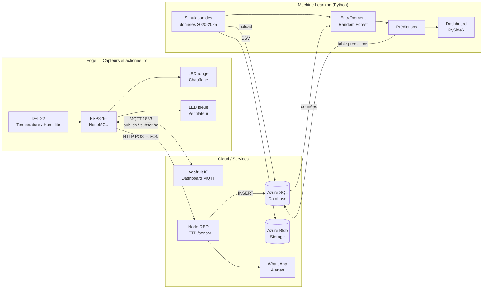
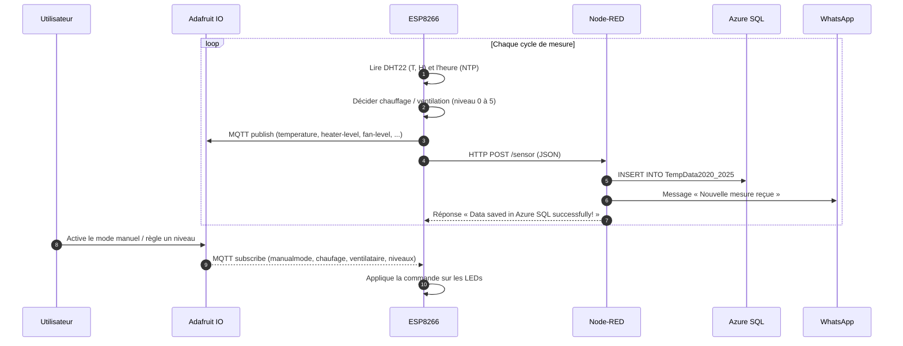
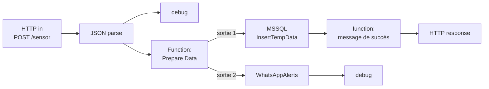
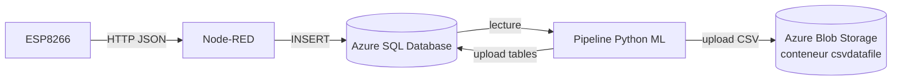

# 🌡️ Système de Climat Intelligent — IoT + Cloud Azure + Machine Learning

Système de contrôle climatique intelligent basé sur un **ESP8266 + capteur DHT22**.
Il mesure la température, pilote automatiquement le chauffage et la ventilation (simulés par des LEDs), envoie les données vers le cloud (**Azure SQL Database** et **Azure Blob Storage**), notifie par **WhatsApp**, se contrôle à distance via **Adafruit IO**, et utilise du **Machine Learning** pour prédire la température.

    

---

## 📑 Sommaire
1. [Fonctionnalités](#-fonctionnalités)
2. [Architecture globale](#-architecture-globale)
3. [Flux de données](#-flux-de-données)
4. [Structure du dépôt](#-structure-du-dépôt)
5. [Matériel et câblage](#-matériel-et-câblage)
6. [Adafruit IO (dashboard)](#-adafruit-io-dashboard)
7. [Node-RED (flux)](#-node-red-flux)
8. [Simulation Wokwi](#-simulation-wokwi)
9. [Azure](#-azure)
10. [Machine Learning](#-machine-learning)
11. [Installation et configuration](#-installation-et-configuration)
12. [Sécurité](#-sécurité)
13. [Améliorations possibles](#-améliorations-possibles)

---

## ✨ Fonctionnalités

- Lecture de la température et de l'humidité (DHT22).
- **Mode automatique** : seuils 22 °C / 25 °C, avec 5 niveaux d'intensité selon l'écart.
  - `T ≥ 25 °C` → ventilation/climatisation (LED bleue)
  - `T ≤ 22 °C` → chauffage (LED rouge)
  - entre les deux → température optimale, tout est éteint
- **Mode manuel** depuis Adafruit IO (interrupteurs chauffage / ventilateur + niveaux 0 à 5).
- Publication MQTT vers **Adafruit IO** (température, niveaux, états, localisation, image).
- Envoi HTTP (JSON) vers **Node-RED**, qui stocke dans **Azure SQL** et envoie une alerte **WhatsApp**.
- **Machine Learning** (Random Forest) pour prédire les températures extérieure et intérieure, avec dashboard desktop (PySide6).
- **Simulation Wokwi** (ESP32) pour tester sans matériel.

---

## 🏗️ Architecture globale


<details>
<summary>Version texte du schéma (Mermaid)</summary>



</details>

---

## 🔄 Flux de données



**Format du JSON envoyé à Node-RED :**

```json
{
  "year": 2026,
  "month": 10,
  "day": 1,
  "hour": "14:30",
  "indoor_temp": 23.45,
  "heater_level": 0,
  "fan_level": 0
}
```

**Feeds Adafruit IO utilisés :**

| Feed | Sens | Rôle |
|------|------|------|
| `temperature` | ESP → Adafruit | Température mesurée |
| `heater-level` / `fan-level` | ESP ⇄ Adafruit | Niveau (0 à 5) du chauffage / ventilateur |
| `chaufage` / `ventilataire` | ESP ⇄ Adafruit | État ON/OFF (et commande en mode manuel) |
| `manualmode` | Adafruit → ESP | Bascule auto / manuel |
| `location` | ESP → Adafruit | Position (Al Hoceima) pour le widget carte |
| `image` | ESP → Adafruit | URL d'une image pour le widget image |

---

## 📂 Structure du dépôt

```
.
├── firmware/
│   ├── esp8266/
│   │   ├── esp8266_climate.ino      # Code réel ESP8266 (DHT22 + MQTT + HTTP)
│   │   └── secrets.h.example        # Modèle pour Wi-Fi / clés (à copier en secrets.h)
│   └── wokwi/                       # Simulation ESP32 (Wokwi)
│       ├── sketch.ino
│       ├── diagram.json
│       ├── libraries.txt
│       └── wokwi-project.txt
├── node-red/
│   └── flow.json                    # Flux Node-RED à importer
├── ml/
│   ├── main.py                      # Orchestrateur (génération → Azure → entraînement → prédictions)
│   ├── dashboard.py                 # Dashboard PySide6
│   ├── prediction_processor.py      # Génération des prédictions
│   ├── user_controle.py             # Surcharge utilisateur des prédictions
│   ├── simulation/                  # Générateurs de données (extérieur / intérieur)
│   ├── model/                       # Entraînement et prédiction (Random Forest)
│   ├── utils/                       # Stockage Azure (SQL + Blob) et visualisation
│   ├── data/                        # CSV 2020-2025 et paramètres de référence
│   ├── requirements.txt
│   └── .env.example                 # Modèle des variables Azure
├── docs/
│   ├── images/                      # Captures d'écran pour le README
│   └── report/                      # Rapport PDF et présentation PowerPoint
└── README.md
```

---

## 🔌 Matériel et câblage

| Composant | Broche ESP8266 (NodeMCU) |
|-----------|--------------------------|
| DHT22 (data) | `D2` |
| LED rouge (chauffage) | `D3` |
| LED bleue (ventilateur / clim.) | `D4` |

Alimentation du DHT22 en 3,3 V, avec une résistance de pull-up (10 kΩ) sur la ligne de données si votre module n'en a pas.

> 📸 **À ajouter** : photo du montage réel → `docs/images/hardware.jpg`

---

## 📊 Adafruit IO (dashboard)

Dashboard de supervision et de contrôle à distance : jauge de température, niveaux chauffage / ventilateur, interrupteurs, mode manuel, carte et image.

> 📸 **Captures à ajouter** (dossier `docs/images/`) :
>
> | Capture | Fichier |
> |---------|---------|
> | Dashboard Adafruit IO complet | `adafruit-dashboard.png` |
> | Liste des feeds | `adafruit-feeds.png` |
> | Contrôle manuel (interrupteurs / niveaux) | `adafruit-manual.png` |
>
> Puis décommentez :
> <!--
> 
> 
> 
> -->

---

## 🔴 Node-RED (flux)

Fichier : [`node-red/flow.json`](node-red/flow.json) → *Menu ☰ → Import → coller / choisir le fichier*.



| Nœud | Rôle |
|------|------|
| `http in` `/sensor` | Reçoit le JSON de l'ESP8266 |
| `json` | Convertit le payload en objet |
| `Function: Prepare Data` | Valide les champs, construit la requête SQL et le message WhatsApp |
| `MSSQL (InsertTempData)` | Insère dans la table `TempData2020_2025` d'Azure SQL |
| `WhatsAppAlerts` | Envoie la notification de mesure |
| `http response` | Répond à l'ESP8266 |

**Palettes Node-RED nécessaires :** `node-red-contrib-mssql-plus` (ou le nœud MSSQL utilisé dans le flux) et `node-red-contrib-whatsapp-cmb`.

> 📸 **À ajouter** : capture de l'éditeur Node-RED → `docs/images/nodered-flow.png`
> <!--  -->

---

## 🧪 Simulation Wokwi

Pour tester sans matériel, une simulation **ESP32** est fournie dans [`firmware/wokwi/`](firmware/wokwi/) (projet à ouvrir sur [wokwi.com](https://wokwi.com)).

| Élément simulé | Broche ESP32 |
|----------------|--------------|
| DHT22 | GPIO 23 |
| LED rouge (chauffage) | GPIO 26 |
| LED bleue (ventilateur) | GPIO 25 |
| Servo (ventilateur) | GPIO 32 |
| LCD 1602 I²C | SDA 21 / SCL 22 |

Particularités de la simulation :
- Wi-Fi `Wokwi-GUEST`, envoi des données vers **ThingSpeak** (toutes les 20 s).
- Alertes **WhatsApp** via CallMeBot.
- Écran LCD pour l'affichage local, servo pour représenter le ventilateur.
- Seuils : confort 20–25 °C, froid extrême 15 °C, chaud extrême 40 °C.

**Comment la lancer :** ouvrir le projet Wokwi, remplacer `YOUR_THINGSPEAK_WRITE_KEY` / `YOUR_CALLMEBOT_KEY` si vous voulez les envois, puis ▶ *Start simulation* et modifier la température du DHT22 pour voir les LEDs et le servo réagir.

> 📸 **Captures à ajouter** :
> | Capture | Fichier |
> |---------|---------|
> | Circuit Wokwi | `docs/images/wokwi-circuit.png` |
> | Cas chaud (LED bleue + servo) | `docs/images/wokwi-hot.png` |
> | Cas froid (LED rouge) | `docs/images/wokwi-cold.png` |
> | Moniteur série | `docs/images/wokwi-serial.png` |
> <!--  -->

---

## ☁️ Azure

Le projet utilise **deux services Microsoft Azure** :

| Service Azure | Type | Rôle dans le projet | Utilisé par |
|---------------|------|---------------------|-------------|
| **Azure SQL Database** | Base de données relationnelle (PaaS, moteur SQL Server) | Stocke les mesures du capteur, l'historique 2020-2025 (extérieur / intérieur) et les prédictions | Node-RED (mesures temps réel) et pipeline Python ML |
| **Azure Blob Storage** | Stockage d'objets (Storage Account, conteneur `csvdatafile`) | Archive les fichiers CSV générés (données extérieures et intérieures) | Pipeline Python ML |



**Tables Azure SQL :**

| Table | Contenu | Alimentée par |
|-------|---------|---------------|
| `TempData2020_2025` | Mesures réelles du DHT22 (année, mois, jour, heure, température, niveaux chauffage / ventilateur) | Node-RED |
| `OutdoorTempData2020_2025` | Températures extérieures horaires | `ml/utils/data_storage.py` |
| `IndoorTempData2020_2025` | Températures intérieures horaires | `ml/utils/data_storage.py` |
| Table de prédictions | Prédictions et niveaux HVAC calculés | `ml/prediction_processor.py` |

> 💡 Dans le code actuel, Node-RED et le pipeline Python pointent vers deux bases différentes. Vous pouvez les regrouper dans une seule base Azure SQL pour simplifier l'architecture.

**Configuration :** les identifiants Azure ne sont jamais dans le code. Ils se renseignent dans `ml/.env` (variables `AZURE_SQL_*` et `AZURE_BLOB_*`) et dans le nœud **AzureSQL** de Node-RED. Pensez à autoriser votre adresse IP dans le pare-feu du serveur Azure SQL.

> 📸 **Captures à ajouter** : Azure SQL (Query editor ou liste des tables) → `docs/images/azure-sql.png`, conteneur Blob avec les CSV → `docs/images/azure-blob.png`
> <!--   -->

---

## 🤖 Machine Learning

- **Données** : séries horaires 2020-2025 (extérieure et intérieure), générées par les scripts de `ml/simulation/` à partir de paramètres climatiques de référence (`ml/data/references/`).
- **Modèle** : `PolynomialFeatures(degree=2)` + `RandomForestRegressor`, un modèle pour l'extérieur et un pour l'intérieur.
- **Validation** : entraînement sur 2020-2024, test sur 2025 (score R² affiché à l'entraînement).
- **Sortie** : prédictions stockées dans Azure SQL, avec calcul des niveaux de chauffage / ventilation pour une température de confort (22 °C par défaut) et possibilité de les ajuster (`user_controle.py`).
- **Dashboard** : application PySide6 + Matplotlib (`dashboard.py`).

Le pipeline complet se lance avec un seul script :

```bash
cd ml
python main.py
```

> 📸 **Captures à ajouter** : dashboard PySide6 → `docs/images/ml-dashboard.png`, courbes de prédiction → `docs/images/ml-prediction.png`
> <!--  -->

---

## ⚙️ Installation et configuration

### 1. Cloner
```bash
git clone https://github.com/<votre-utilisateur>/<nom-du-repo>.git
cd <nom-du-repo>
```

### 2. Firmware ESP8266
1. Arduino IDE → installer la carte **ESP8266** (gestionnaire de cartes).
2. Bibliothèques : `DHT sensor library`, `Adafruit Unified Sensor`, `Adafruit MQTT Library`.
3. Copier `firmware/esp8266/secrets.h.example` → `secrets.h` et remplir : Wi-Fi, IP de Node-RED, identifiants Adafruit IO.
4. Créer les feeds Adafruit IO listés plus haut.
5. Ouvrir `esp8266_climate.ino`, choisir la carte NodeMCU et téléverser.

### 3. Node-RED
1. Installer les palettes (MSSQL, WhatsApp).
2. Importer `node-red/flow.json`.
3. Configurer le nœud **AzureSQL** (serveur, base, identifiants) et le compte WhatsApp.
4. Déployer.

### 4. Machine Learning
```bash
cd ml
python -m venv .venv && source .venv/bin/activate   # Windows : .venv\Scripts\activate
pip install -r requirements.txt
cp .env.example .env     # puis remplir les variables Azure
python main.py
```
Prérequis : **ODBC Driver 18 for SQL Server** installé sur la machine.

---

## 🔐 Sécurité

Ce dépôt **ne contient aucun secret**. Les identifiants (Wi-Fi, Adafruit IO, Azure SQL, Azure Blob, ThingSpeak, CallMeBot) sont fournis via `secrets.h` et `.env`, tous deux ignorés par Git (`.gitignore`). Ne les commitez jamais.

---

## 🚀 Améliorations possibles

- Requêtes SQL **paramétrées** dans Node-RED (la requête actuelle est construite par concaténation).
- Remplacer le HTTP en clair par HTTPS entre l'ESP8266 et Node-RED.
- Limiter les alertes WhatsApp (seuils / anti-spam) au lieu d'une alerte à chaque mesure.
- Dockeriser Node-RED et le pipeline ML.
- Application web pour afficher les prédictions.

---

## 👥 Auteurs

Projet réalisé dans le cadre d'un projet IoT — *ajoutez ici vos noms, école et année*.

## 📄 Documentation complémentaire

- 📕 [Rapport du projet (PDF)](docs/report/Rapport_Systeme_Climat_Intelligent.pdf)
- 📊 [Présentation (PowerPoint)](docs/report/Presentation_Systeme_Climat_Intelligent.pptx)
