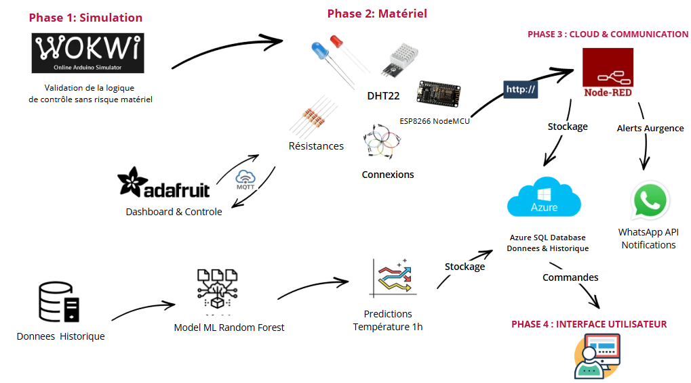
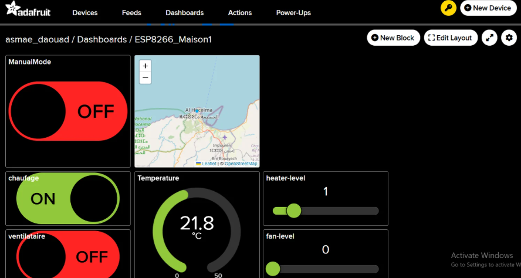
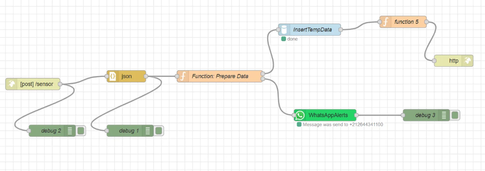
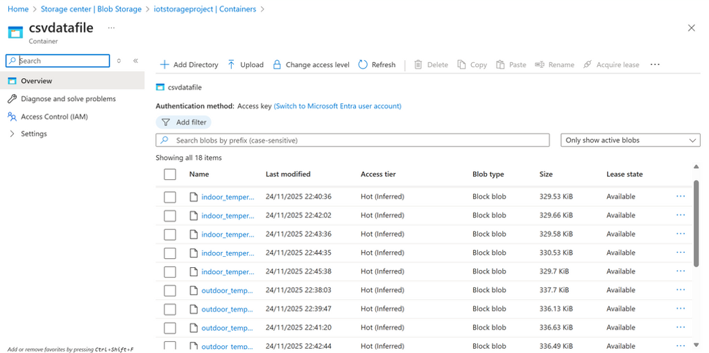
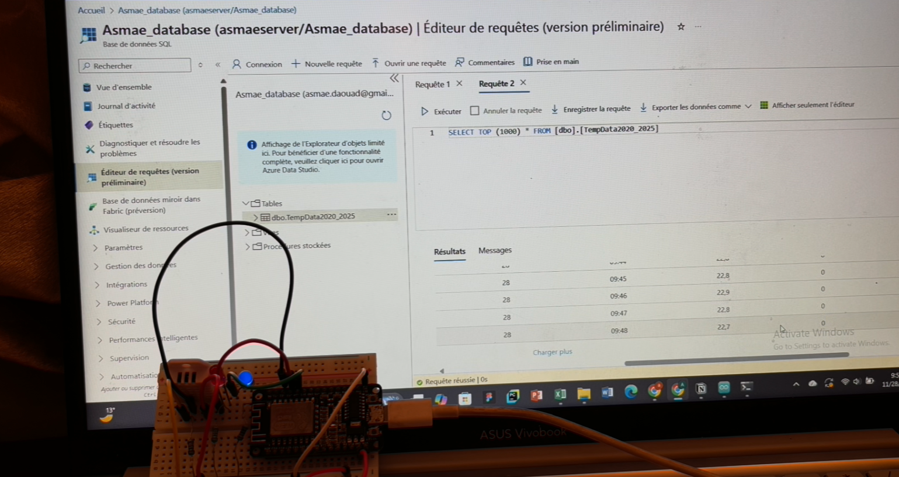
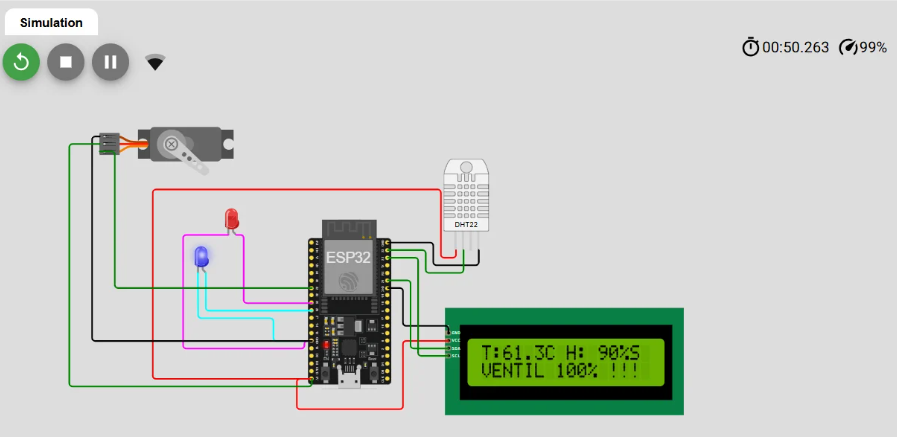

#  Système de Climat Intelligent — IoT, Cloud Azure & Machine Learning

Système de contrôle climatique intelligent de bout en bout : un **ESP8266 + capteur DHT22** mesure la température, pilote automatiquement chauffage et ventilation, envoie les données vers le **cloud Azure**, alerte par **WhatsApp**, se contrôle à distance via **Adafruit IO**, et utilise le **Machine Learning** pour prédire la température.


## Compétences démontrées

| Domaine | Technologies |
|---------|--------------|
| **IoT / Embarqué** | ESP8266, DHT22, C++ Arduino, MQTT, HTTP, NTP |
| **Cloud** | Azure SQL Database, Azure Blob Storage |
| **Intégration / Automatisation** | Node-RED, Adafruit IO, alertes WhatsApp |
| **Data / ML** | Python, pandas, scikit-learn (Random Forest), PySide6, Matplotlib |
| **Bonnes pratiques** | Gestion des secrets (`.env`, `secrets.h`), simulation Wokwi, documentation |

---

##  Fonctionnalités

- Lecture de la **température et de l'humidité** (DHT22).
- **Mode automatique** avec seuils 22 °C / 25 °C et 5 niveaux d'intensité :
  - `T ≥ 25 °C` → ventilation / climatisation (LED bleue)
  - `T ≤ 22 °C` → chauffage (LED rouge)
  - entre les deux → température optimale, tout est éteint
- **Mode manuel** depuis Adafruit IO (interrupteurs chauffage / ventilateur, niveaux 0 à 5).
- Publication **MQTT** vers Adafruit IO (température, niveaux, états, localisation).
- Envoi **HTTP (JSON)** vers Node-RED → stockage dans **Azure SQL** + alerte **WhatsApp**.
- **Machine Learning** : prédiction des températures extérieure et intérieure + dashboard desktop.
- **Simulation Wokwi** (ESP32) pour tester sans matériel.

---

##  Architecture



**Principe de fonctionnement :**

1. L'ESP8266 lit le DHT22 et décide du chauffage / de la ventilation (niveau 0 à 5).
2. Il publie les données sur **Adafruit IO** (MQTT) et les envoie à **Node-RED** (HTTP POST).
3. Node-RED les enregistre dans **Azure SQL** et envoie une notification **WhatsApp**.
4. Le pipeline **ML** (Python) lit les données Azure, entraîne les modèles et stocke les prédictions.
5. L'utilisateur peut reprendre la main à distance depuis le dashboard Adafruit IO.

**Exemple de JSON envoyé à Node-RED :**

```json
{
  "year": 2026,
  "month": 10,
  "day": 1,
  "hour": "14:30",
  "indoor_temp": 23.45,
  "heater_level": 0,
  "fan_level": 0
}
```

---

##  Matériel et câblage

| Composant | Broche ESP8266 (NodeMCU) |
|-----------|--------------------------|
| DHT22 (data) | `D2` |
| LED rouge (chauffage) | `D3` |
| LED bleue (ventilateur / clim.) | `D4` |

Alimentation du DHT22 en 3,3 V, avec une résistance de pull-up de 10 kΩ sur la ligne de données si le module n'en possède pas.

---

##  Adafruit IO — Dashboard de contrôle

Supervision et contrôle à distance : jauge de température, niveaux chauffage / ventilateur, interrupteurs, mode manuel, carte et image.



| Feed | Sens | Rôle |
|------|------|------|
| `temperature` | ESP → Adafruit | Température mesurée |
| `heater-level` / `fan-level` | ESP ⇄ Adafruit | Niveau (0 à 5) du chauffage / ventilateur |
| `chaufage` / `ventilataire` | ESP ⇄ Adafruit | État ON/OFF (commande en mode manuel) |
| `manualmode` | Adafruit → ESP | Bascule automatique / manuel |
| `location` | ESP → Adafruit | Position pour le widget carte |
| `image` | ESP → Adafruit | URL d'image pour le widget image |

---

##  Node-RED — Flux d'intégration

Fichier : [`node-red/flow.json`](node-red/flow.json) → *Menu ☰ → Import*.



| Nœud | Rôle |
|------|------|
| `http in` `/sensor` | Reçoit le JSON de l'ESP8266 |
| `json` | Convertit le payload en objet |
| `Function: Prepare Data` | Valide les champs, construit la requête SQL et le message WhatsApp |
| `MSSQL` | Insère dans la table `TempData2020_2025` d'Azure SQL |
| `WhatsAppAlerts` | Envoie la notification |
| `http response` | Répond à l'ESP8266 |

**Palettes requises :** `node-red-contrib-mssql-plus` et `node-red-contrib-whatsapp-cmb`.

---

##  Azure

| Service | Rôle dans le projet |
|---------|---------------------|
| **Azure SQL Database** | Stocke les mesures du capteur, l'historique 2020-2025 (extérieur / intérieur) et les prédictions |
| **Azure Blob Storage** | Archive les fichiers CSV générés (conteneur `csvdatafile`) |




**Tables Azure SQL :**

| Table | Contenu | Alimentée par |
|-------|---------|---------------|
| `TempData2020_2025` | Mesures réelles du DHT22 | Node-RED |
| `OutdoorTempData2020_2025` | Températures extérieures horaires | Pipeline ML |
| `IndoorTempData2020_2025` | Températures intérieures horaires | Pipeline ML |
| Table de prédictions | Prédictions et niveaux HVAC calculés | Pipeline ML |

---

##  Machine Learning

- **Données** : séries horaires 2020-2025 (extérieure et intérieure), générées par `ml/simulation/` à partir de paramètres climatiques de référence.
- **Modèle** : `PolynomialFeatures(degree=2)` + `RandomForestRegressor` (un modèle extérieur, un modèle intérieur).
- **Validation** : entraînement sur 2020-2024, test sur 2025 (score R²).
- **Sortie** : prédictions stockées dans Azure SQL, avec calcul des niveaux de chauffage / ventilation pour une température de confort (22 °C par défaut), ajustables via `user_controle.py`.
- **Dashboard** : application PySide6 + Matplotlib (`dashboard.py`).

Lancer le pipeline complet (génération → Azure → entraînement → prédictions) :

```bash
cd ml
python main.py
```

---

##  Simulation Wokwi (ESP32)

Pour tester sans matériel : [`firmware/wokwi/`](firmware/wokwi/) (à ouvrir sur [wokwi.com](https://wokwi.com)).



| Élément simulé | Broche ESP32 |
|----------------|--------------|
| DHT22 | GPIO 23 |
| LED rouge (chauffage) | GPIO 26 |
| LED bleue (ventilateur) | GPIO 25 |
| Servo (ventilateur) | GPIO 32 |
| LCD 1602 I²C | SDA 21 / SCL 22 |

Envoi des données vers ThingSpeak, alertes WhatsApp via CallMeBot, écran LCD local et servo pour représenter le ventilateur.

---

##  Structure du dépôt

```
.
├── firmware/
│   ├── esp8266/            # Code réel ESP8266 (DHT22 + MQTT + HTTP)
│   └── wokwi/              # Simulation ESP32 (Wokwi)
├── node-red/
│   └── flow.json           # Flux Node-RED à importer
├── ml/
│   ├── main.py             # Orchestrateur du pipeline
│   ├── dashboard.py        # Dashboard PySide6
│   ├── prediction_processor.py
│   ├── user_controle.py
│   ├── simulation/         # Générateurs de données
│   ├── model/              # Entraînement et prédiction
│   ├── utils/              # Stockage Azure et visualisation
│   └── data/               # CSV 2020-2025 et paramètres
├── docs/
│   ├── images/             # Captures d'écran
│   └── report/             # Présentation PowerPoint
└── README.md
```

---

## Installation

### 1. Cloner
```bash
git clone https://github.com/<votre-utilisateur>/<nom-du-repo>.git
cd <nom-du-repo>
```

### 2. Firmware ESP8266
1. Arduino IDE → installer la carte **ESP8266**.
2. Installer les bibliothèques : `DHT sensor library`, `Adafruit Unified Sensor`, `Adafruit MQTT Library`.
3. Copier `firmware/esp8266/secrets.h.example` → `secrets.h` et renseigner Wi-Fi, IP de Node-RED et identifiants Adafruit IO.
4. Créer les feeds Adafruit IO listés plus haut.
5. Ouvrir `esp8266_climate.ino`, choisir la carte NodeMCU et téléverser.

### 3. Node-RED
1. Installer les palettes MSSQL et WhatsApp.
2. Importer `node-red/flow.json`.
3. Configurer le nœud **AzureSQL** et le compte WhatsApp, puis déployer.

### 4. Machine Learning
```bash
cd ml
python -m venv .venv && source .venv/bin/activate   # Windows : .venv\Scripts\activate
pip install -r requirements.txt
cp .env.example .env     # puis renseigner les variables Azure
python main.py
```
Prérequis : **ODBC Driver 18 for SQL Server**. Pensez à autoriser votre IP dans le pare-feu d'Azure SQL.


##  Documentation

-  [Présentation du projet (PowerPoint)](docs/report/Presentation_Systeme_Climat_Intelligent.pptx)

---


**Asmae Daouad** , 2025
